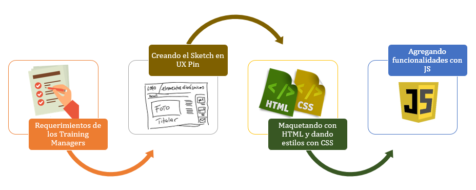
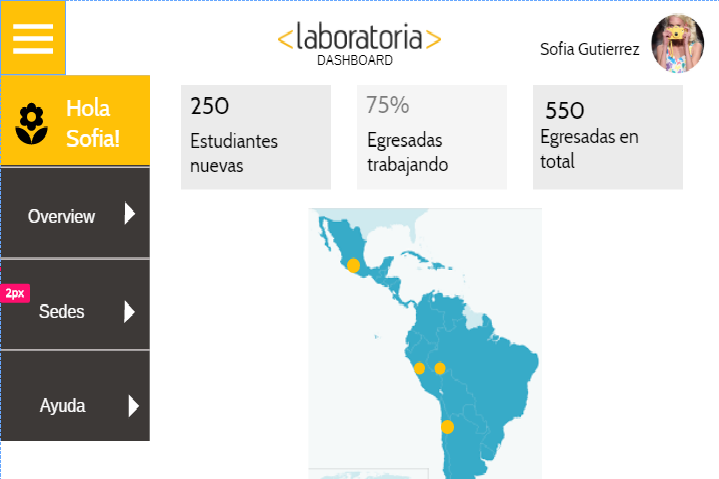
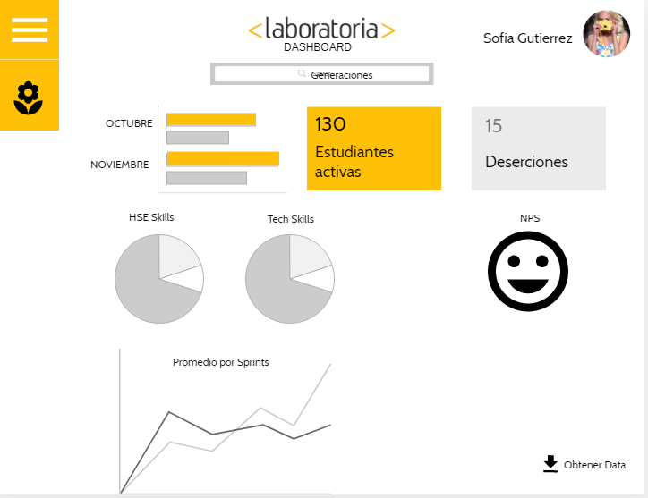
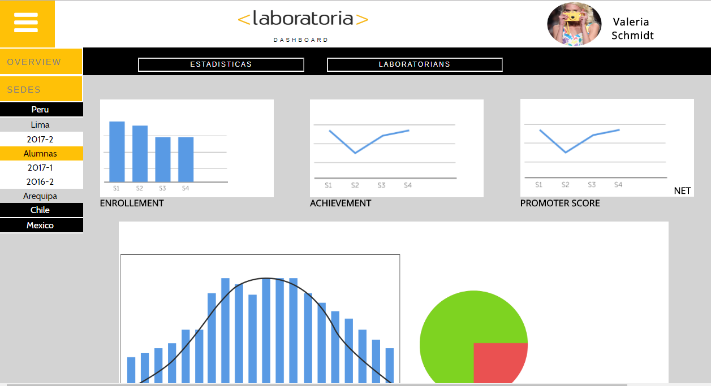
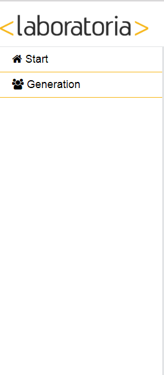
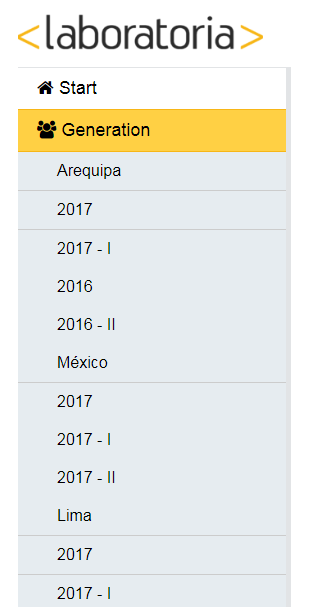
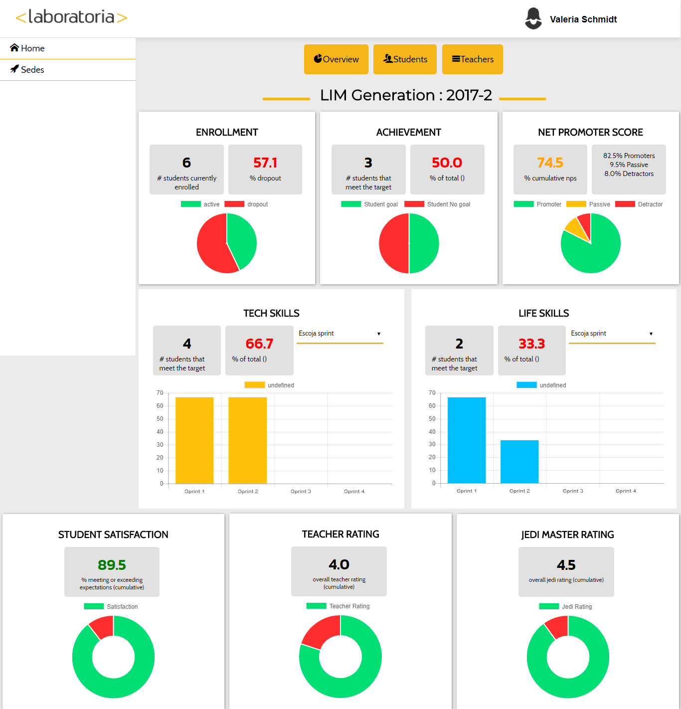

# Data Dashboard
***

## Objetivo:
   Desarrollar un Dashboard para que los Training Managers (TMs) de Laboratoria, visualicen el desempeño de las estudiantes.

***

## Proceso:

### 1. Requerimientos de los Training Managers:
 * El total de estudiantes presentes por sede y generación.
 * El porcentaje de deserción de estudiantes.
 * La cantidad de estudiantes que superan la meta de puntos en promedio de todos los sprints cursados. La meta de puntos es 70% del total de puntos en HSE y en tech.
 * El porcentaje que representa el dato anterior en relación al total de estudiantes.
 * El Net Promoter Score (NPS) promedio de los sprints cursados. El NPS se calcula en base a la encuesta que las estudiantes responden al respecto de la recomendación que darían de Laboratoria, bajo la siguiente fórmula:

 **[Promoters] = [Respuestas 9 o 10] / [Total respuestas] * 100
   [Passive] = [Respuestas 7 u 8] / [Total respuestas] * 100
   [Detractors] = [Respuestas entre 1 y 6] / [Total respuestas] * 100
   [NPS] = [Promoters] - [Detractors]**

 * La cantidad y el porcentaje que representa el total de estudiantes que superan la meta de puntos técnicos en promedio y por sprint.
 * La cantidad y el porcentaje que representa el total de estudiantes que superan la meta de puntos de HSE en promedio y por sprint.
 * El porcentaje de estudiantes satisfechas con la experiencia de Laboratoria.
 * La puntuación promedio de los profesores.
 * La puntuación promedio de los jedi masters.

***

### 2. Creando el Sketch en UX Pin

Para iniciar el proceso, se diseñó los siguientes Sketchs usando la herramienta [UXPin](https://www.uxpin.com "UXPin")

  

  

## 3. Maquetando con HTML y dando estilos con CSS

Para la elaboración del proyecto hemos decidido estructurar el html con: Una etiqueta header para el encabezado.

Para el cuerpo del proyecto, se ha estructurado con etiquetas section, una para el menú como se muestra en la imagen, otra para el contenido general información de docentes y alumnas y otra para los botones de navegación.

El menú de navegación, tiene la funcionalidad de ser desplegable cuando se acerca el puntero del mouse a Generation, tal cual en la imagen que nos permitirá seleccionar una sede en específico.

 

## 4. Agregando funcionalidades con JS

      Para la visualización de los datos se han creado funciones para cada requerimiento.

***
### 5. Producto Terminado

### Trabajo realizado por:
#### Squad :  Women@Design
#### Integrantes :

1. Ana Lorena Diaz
2. Carla Centeno
3. Claudia Zarate
4. Lesly Nomberto
5. Lizbeth Félix
6. Karina Ramirez
7. Melyna Pernia
8. Tahirih Jaliri
